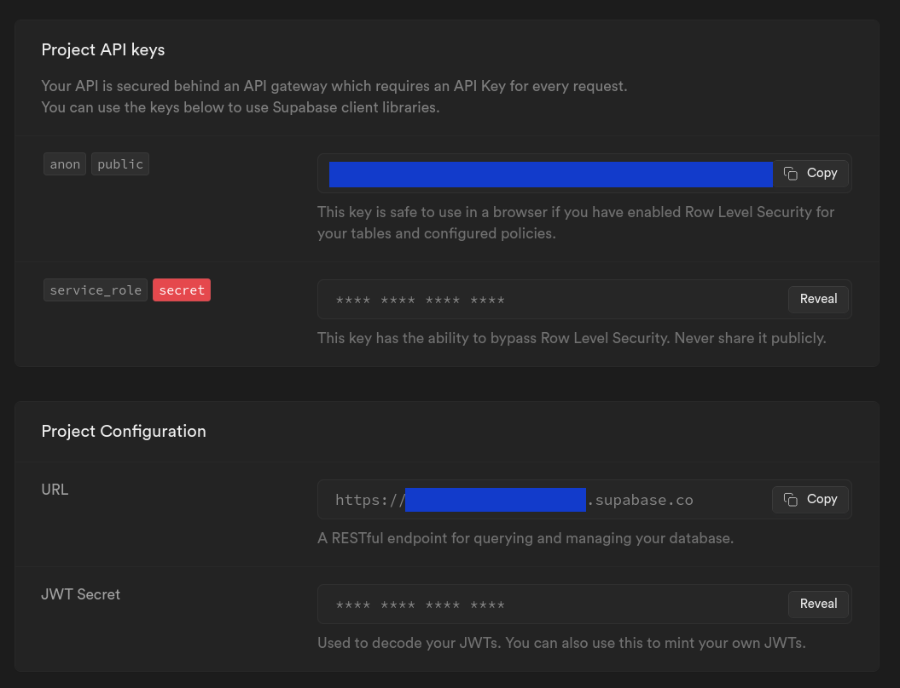
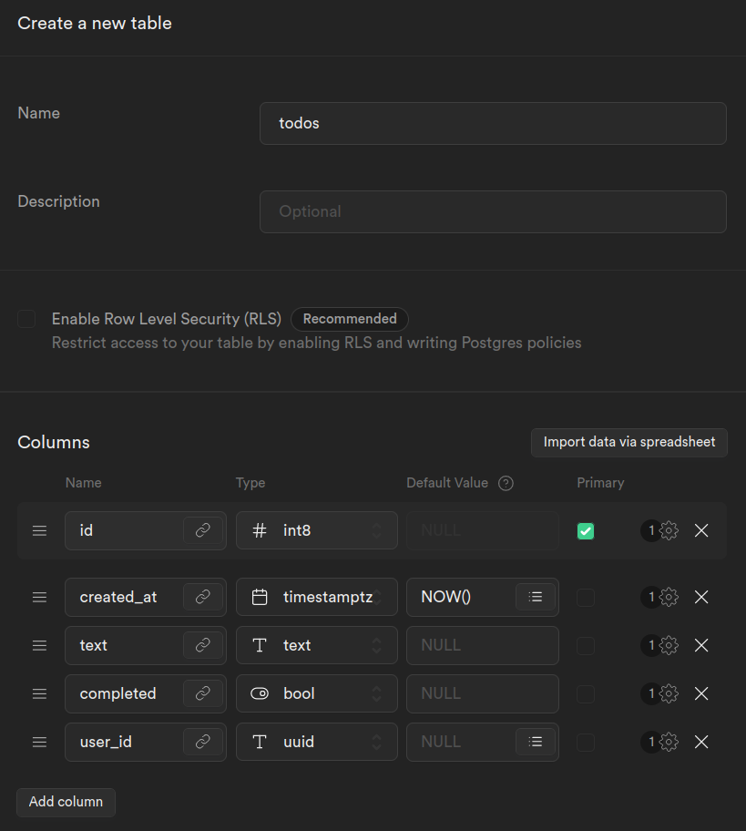
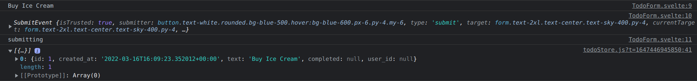
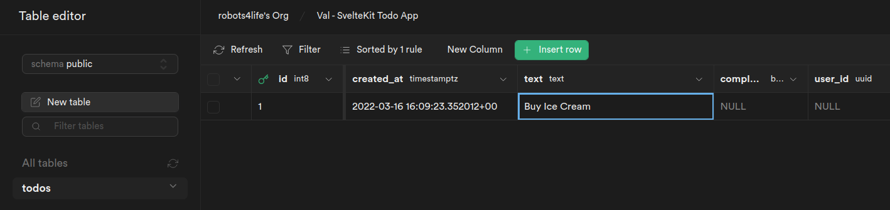

# Full Stack SvelteKit Todo App

There are two branches.

**<a href="https://github.com/robots4life/val/tree/local">`local`</a>** is the first part of the app where the Todos are stored in a SvelteKit store.

https://www.youtube.com/watch?v=YipaPr4Aex8

Reference: https://github.com/jamesqquick/svelte-kit-supabase-todo-app-with-tailwind/tree/todos-no-supabase

</br>
</br>

**<a href="https://github.com/robots4life/val/tree/supabase">`supabase`</a>** is the second part of the app where everything runs on Supabase including User Authentication via Magic Link.

Both apps are styled with Tailwind CSS.

https://www.youtube.com/watch?v=YqIyET7XKIQ

Reference: https://github.com/jamesqquick/svelte-kit-supabase-todo-app-with-tailwind/tree/add-supabase
</br>
</br>

**2022-03-16 `npm ls`**

```shell
val@0.0.1 /shared/httpd/val
├── @sveltejs/adapter-auto@1.0.0-next.31
├── @sveltejs/kit@1.0.0-next.295
├── autoprefixer@10.4.2
├── env-cmd@10.1.0
├── eslint-config-prettier@8.5.0
├── eslint-plugin-svelte3@3.4.1
├── eslint@7.32.0
├── postcss@8.4.8
├── prettier-plugin-svelte@2.6.0
├── prettier@2.5.1
├── svelte@3.46.4
└── tailwindcss@3.0.23
```

</br>
</br>

## supabase

### 1.

Setup Supabase and model the data inside the database.

a)  
We need `text` as a `string` for the Todo.

b)  
We need the `completed` state as a `boolean` for the Todo.

c)  
We need a User ID for the user that created the Todo.
As we progress we will later add this part in the database.

### 2.

Add Supabase JavaScript Client Library.

https://github.com/supabase/supabase-js

`npm install @supabase/supabase-js`

After that we can see that the Supabase JavaScript Client Library has been added to the project.

`npm ls`

```shell
val@0.0.1 /shared/httpd/val
├── @supabase/supabase-js@1.31.1
├── @sveltejs/adapter-auto@1.0.0-next.31
├── @sveltejs/kit@1.0.0-next.295
├── autoprefixer@10.4.2
├── env-cmd@10.1.0
├── eslint-config-prettier@8.5.0
├── eslint-plugin-svelte3@3.4.1
├── eslint@7.32.0
├── postcss@8.4.8
├── prettier-plugin-svelte@2.6.0
├── prettier@2.5.1
├── svelte@3.46.4
└── tailwindcss@3.0.23
```

### 3.

Create a `supabase.js` file to import the Supabase JavaScript Client Library and create a connection with the database.

`src/lib/supabase.js`

```js
import { createClient } from '@supabase/supabase-js';

// https://kit.svelte.dev/faq#how-do-i-use-environment-variables
const supabaseURL = import.meta.env.VITE_PUBLIC_SUPABASE_URL;
const supabaseAnonKey = import.meta.env.VITE_PUBLIC_SUPABASE_ANON_KEY;

export const supabase = createClient(supabaseURL, supabaseAnonKey);

// https://stackoverflow.com/a/21117231
// create a default export so supabase is available without curly braces
export default supabase;
```

</br>
</br>

In `supabase.js` there are two environment variables being used, `VITE_PUBLIC_SUPABASE_URL` and `VITE_PUBLIC_SUPABASE_ANON_KEY`.
The values for these environment variables are created inside the Supabase app.



</br>
</br>

To be able to use environment variables with SvelteKit we use an `.env` file in the root of the repository.
This file is excluded by `.gitignore`.

```shell
VITE_PUBLIC_SUPABASE_URL=https://example.supabase.co
```

Check this link to learn about about environment variables and SvelteKit.
https://kit.svelte.dev/faq#how-do-i-use-environment-variables

</br>
</br>

To check if the Supabase client is working we can do a simple log.

`src/routes/__layout.svelte`

```html
<script>
	import '../app.css';

	import { supabase } from '$lib/supabase.js';

	console.log(supabase);
</script>
```

The output of logging the Supabase client then looks something like this.

```shell
SupabaseClient {
  supabaseUrl: 'https://example.supabase.co',
  supabaseKey: '...',
  restUrl: 'https://example.supabase.co/rest/v1',
  realtimeUrl: 'wss://example.supabase.co/realtime/v1',
  authUrl: 'https://example.supabase.co/auth/v1',
  storageUrl: 'https://example.supabase.co/storage/v1',
  schema: 'public',
  multiTab: true,
  fetch: undefined,
  headers: { 'X-Client-Info': 'supabase-js/1.31.1' },
  shouldThrowOnError: false,
  auth: SupabaseAuthClient {
    stateChangeEmitters: Map(1) { 'example-uuid' => [Object] },
    currentUser: null,
    currentSession: null,
    autoRefreshToken: true,
    persistSession: true,
    multiTab: true,
    localStorage: undefined,
    api: GoTrueApi {
      url: 'https://example.supabase.co/auth/v1',
      headers: [Object],
      cookieOptions: [Object],
      fetch: [Function (anonymous)]
    }
  },
  realtime: RealtimeClient {
    accessToken: null,
    channels: [],
    endPoint: 'wss://example.supabase.co/realtime/v1/websocket',
    headers: { 'X-Client-Info': 'supabase-js/1.31.1' },
    params: {
      apikey: '...'
    },
    timeout: 10000,
    transport: [Function: W3CWebSocket],
    heartbeatIntervalMs: 30000,
    longpollerTimeout: 20000,
    heartbeatTimer: undefined,
    pendingHeartbeatRef: null,
    ref: 0,
    logger: [Function: noop],
    conn: null,
    sendBuffer: [],
    serializer: Serializer { HEADER_LENGTH: 1 },
    stateChangeCallbacks: { open: [], close: [], error: [], message: [] },
    reconnectAfterMs: [Function (anonymous)],
    encode: [Function (anonymous)],
    decode: [Function: bound decode],
    reconnectTimer: Timer {
      callback: [Function (anonymous)],
      timerCalc: [Function (anonymous)],
      timer: undefined,
      tries: 0
    }
  }
}
```

### 4.

Model the data inside the database.

Create a `todos` table with the following rows.

| Name         | Type         | Default Value |
| ------------ | ------------ | ------------- |
| `created_at` | `timestampz` | `NOW()`       |
| `text`       | `text`       | `NULL`        |
| `completed`  | `bool`       | `NULL`        |
| `user_id`    | `uuid`       | `NULL`        |

</br>
</br>

It looks like this in the Supabase editor.



</br>
</br>

### 5.

Load Todos from Supabase

`src/stores/todoStore.js`

```js
//
// Load Todos from Supabase
export const loadTodos = async () => {
	const { data, error } = await supabase.from('todos').select();

	if (error) return console.log(error);

	todos.set(data);
};
```

### 6.

Add Todo to Supabase.

`src/stores/todoStore.js`

```js
//
// Add Todo
export const addTodo = async (text, user_id) => {
        //
	// add Todo to Supabase
	const { data, error } = await supabase
            .from('todos')
            .insert([{ text, user_id }]);

	if (error) return console.log(error);

  ...
```

### 7.

Delete Todo from Supabase.

```js
// Delete Todo
export const deleteTodo = async (id) => {
	//
	// delete Todo from Supabase
	const { error } = await supabase
            .from('todo')
            .delete()
            .match({ id });

	if (error) return console.log(error);

  ...
```

### 8.

Update Todo completed state.

```js
// Toggle Todo Completed
export const toggleTodoCompleted = async (id, currentState) => {
	//
	// update Todo completed state
	const { error } = await supabase
            .from('todo')
            .update({ completed: !currentState })
            .match({ id });

	if (error) return console.log(error);

  ...
```

### 9.

Buy Ice Cream



</br>
</br>



</br>
</br>

First ever Todo created on Supabase with SvelteKit on **`2022-03-16T16:09:23.352012+00:00`**.

Super happy, oh yeah. :)

:sparkles::sparkles::sparkles::sparkles::sparkles:

### 10.

Create an Auth component for Supabase Authentication with SvelteKit.

`src/lib/Auth.svelte`

```html
<script>
	import supabase from '$lib/supabase';

	let loading = false;
	let email;

	const handleLogin = async () => {
		try {
			// the loading state starts here
			loading = true;

			console.log(email);

			// hello ? could this be any easier ?
			const { error } = await supabase.auth.signIn({ email });

			// if there is something wrong with either the email or the request
			if (error) throw error;

			// on success display an alert to the user to check their email inbox
			alert('Check your email for the login link!');
		} catch (error) {
			console.error(error);

			alert(error.error_description || error.message);
		} finally {
			// the loading state is finally finished here
			loading = false;
		}
	};
</script>

<h1>Log in</h1>
<p>Sign in via magic link with your email below</p>

<!-- https://svelte.dev/tutorial/event-modifiers preventDefault on the submit event -->
<form on:submit|preventDefault="{handleLogin}">
	<div>
		<label for="login"> Email </label>
		<input type="email" name="email" bind:value="{email}" placeholder="Your email" />
	</div>
	<button type="submit" disabled="{loading}">Log In</button>
</form>
```

Load the Auth component in the Layout.

`src/routes/__layout.svelte`

```html
<script>
	import '../app.css';
	import Auth from '$lib/Auth.svelte';
</script>

<main class="container py-4 my-4"><Auth /><slot /></main>
```
