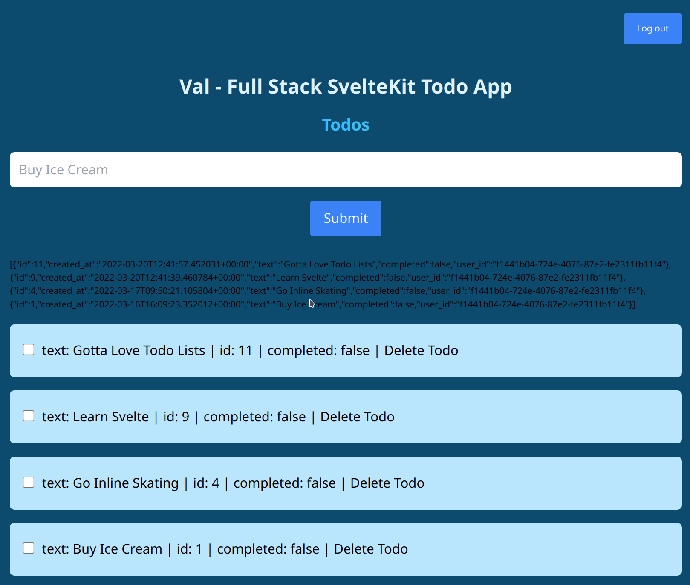

# Full Stack SvelteKit Todo App

There are two branches.

**<a href="https://github.com/robots4life/val/tree/local">`local`</a>** is the first part of the app where the Todos are stored in a SvelteKit store.

https://www.youtube.com/watch?v=YipaPr4Aex8

Reference: https://github.com/jamesqquick/svelte-kit-supabase-todo-app-with-tailwind/tree/todos-no-supabase

</br>
</br>

**<a href="https://github.com/robots4life/val/tree/supabase">`supabase`</a>** is the second part of the app where everything runs on Supabase including User Authentication via Magic Link.

Both apps are styled with Tailwind CSS.

https://www.youtube.com/watch?v=YqIyET7XKIQ

Reference: https://github.com/jamesqquick/svelte-kit-supabase-todo-app-with-tailwind/tree/add-supabase
</br>
</br>

**2022-03-16 `npm ls`**

```shell
val@0.0.1 /shared/httpd/val
├── @sveltejs/adapter-auto@1.0.0-next.31
├── @sveltejs/kit@1.0.0-next.295
├── autoprefixer@10.4.2
├── env-cmd@10.1.0
├── eslint-config-prettier@8.5.0
├── eslint-plugin-svelte3@3.4.1
├── eslint@7.32.0
├── postcss@8.4.8
├── prettier-plugin-svelte@2.6.0
├── prettier@2.5.1
├── svelte@3.46.4
└── tailwindcss@3.0.23
```

</br>
</br>

## supabase

### 1.

Setup Supabase and model the data inside the database.

a)  
We need `text` as a `string` for the Todo.

b)  
We need the `completed` state as a `boolean` for the Todo.

c)  
We need a User ID for the user that created the Todo.
As we progress we will later add this part in the database.

### 2.

Add Supabase JavaScript Client Library.

https://github.com/supabase/supabase-js

`npm install @supabase/supabase-js`

After that we can see that the Supabase JavaScript Client Library has been added to the project.

`npm ls`

```shell
val@0.0.1 /shared/httpd/val
├── @supabase/supabase-js@1.31.1
├── @sveltejs/adapter-auto@1.0.0-next.31
├── @sveltejs/kit@1.0.0-next.295
├── autoprefixer@10.4.2
├── env-cmd@10.1.0
├── eslint-config-prettier@8.5.0
├── eslint-plugin-svelte3@3.4.1
├── eslint@7.32.0
├── postcss@8.4.8
├── prettier-plugin-svelte@2.6.0
├── prettier@2.5.1
├── svelte@3.46.4
└── tailwindcss@3.0.23
```

### 3.

Create a `supabase.js` file to import the Supabase JavaScript Client Library and create a connection with the database.

`src/lib/supabase.js`

```js
import { createClient } from '@supabase/supabase-js';

// https://kit.svelte.dev/faq#how-do-i-use-environment-variables
const supabaseURL = import.meta.env.VITE_PUBLIC_SUPABASE_URL;
const supabaseAnonKey = import.meta.env.VITE_PUBLIC_SUPABASE_ANON_KEY;

export const supabase = createClient(supabaseURL, supabaseAnonKey);

// https://stackoverflow.com/a/21117231
// create a default export so supabase is available without curly braces
export default supabase;
```

</br>
</br>

In `supabase.js` there are two environment variables being used, `VITE_PUBLIC_SUPABASE_URL` and `VITE_PUBLIC_SUPABASE_ANON_KEY`.
The values for these environment variables are created inside the Supabase app.


</br>
</br>

To be able to use environment variables with SvelteKit we use an `.env` file in the root of the repository.
This file is excluded by `.gitignore`.

```shell
VITE_PUBLIC_SUPABASE_URL=https://example.supabase.co
```

Check this link to learn about about environment variables and SvelteKit.
https://kit.svelte.dev/faq#how-do-i-use-environment-variables

</br>
</br>

To check if the Supabase client is working we can do a simple log.

`src/routes/__layout.svelte`

```html
<script>
	import '../app.css';

	import { supabase } from '$lib/supabase.js';

	console.log(supabase);
</script>
```

The output of logging the Supabase client then looks something like this.

```shell
SupabaseClient {
  supabaseUrl: 'https://example.supabase.co',
  supabaseKey: '...',
  restUrl: 'https://example.supabase.co/rest/v1',
  realtimeUrl: 'wss://example.supabase.co/realtime/v1',
  authUrl: 'https://example.supabase.co/auth/v1',
  storageUrl: 'https://example.supabase.co/storage/v1',
  schema: 'public',
  multiTab: true,
  fetch: undefined,
  headers: { 'X-Client-Info': 'supabase-js/1.31.1' },
  shouldThrowOnError: false,
  auth: SupabaseAuthClient {
    stateChangeEmitters: Map(1) { 'example-uuid' => [Object] },
    currentUser: null,
    currentSession: null,
    autoRefreshToken: true,
    persistSession: true,
    multiTab: true,
    localStorage: undefined,
    api: GoTrueApi {
      url: 'https://example.supabase.co/auth/v1',
      headers: [Object],
      cookieOptions: [Object],
      fetch: [Function (anonymous)]
    }
  },
  realtime: RealtimeClient {
    accessToken: null,
    channels: [],
    endPoint: 'wss://example.supabase.co/realtime/v1/websocket',
    headers: { 'X-Client-Info': 'supabase-js/1.31.1' },
    params: {
      apikey: '...'
    },
    timeout: 10000,
    transport: [Function: W3CWebSocket],
    heartbeatIntervalMs: 30000,
    longpollerTimeout: 20000,
    heartbeatTimer: undefined,
    pendingHeartbeatRef: null,
    ref: 0,
    logger: [Function: noop],
    conn: null,
    sendBuffer: [],
    serializer: Serializer { HEADER_LENGTH: 1 },
    stateChangeCallbacks: { open: [], close: [], error: [], message: [] },
    reconnectAfterMs: [Function (anonymous)],
    encode: [Function (anonymous)],
    decode: [Function: bound decode],
    reconnectTimer: Timer {
      callback: [Function (anonymous)],
      timerCalc: [Function (anonymous)],
      timer: undefined,
      tries: 0
    }
  }
}
```

### 4.

Model the data inside the database.

Create a `todos` table with the following rows.

| Name         | Type         | Default Value |
| ------------ | ------------ | ------------- |
| `created_at` | `timestampz` | `NOW()`       |
| `text`       | `text`       | `NULL`        |
| `completed`  | `bool`       | `NULL`        |
| `user_id`    | `uuid`       | `NULL`        |

</br>
</br>

It looks like this in the Supabase editor.


</br>
</br>

### 5.

Load Todos from Supabase

`src/stores/todoStore.js`

```js
//
// Load Todos from Supabase
export const loadTodos = async () => {
	const { data, error } = await supabase.from('todos').select();

	if (error) return console.log(error);

	todos.set(data);
};
```

### 6.

Add Todo to Supabase.

`src/stores/todoStore.js`

```js
//
// Add Todo
export const addTodo = async (text, user_id) => {
        //
	// add Todo to Supabase
	const { data, error } = await supabase
            .from('todos')
            .insert([{ text, user_id }]);

	if (error) return console.log(error);

  ...
```

### 7.

Delete Todo from Supabase.

```js
// Delete Todo
export const deleteTodo = async (id) => {
	//
	// delete Todo from Supabase
	const { error } = await supabase
            .from('todo')
            .delete()
            .match({ id });

	if (error) return console.log(error);

  ...
```

### 8.

Update Todo completed state.

```js
// Toggle Todo Completed
export const toggleTodoCompleted = async (id, currentState) => {
	//
	// update Todo completed state
	const { error } = await supabase
            .from('todo')
            .update({ completed: !currentState })
            .match({ id });

	if (error) return console.log(error);

  ...
```

### 9.

Buy Ice Cream


</br>
</br>


</br>
</br>

First ever Todo created on Supabase with SvelteKit on **`2022-03-16T16:09:23.352012+00:00`**.

Super happy, oh yeah. :)

:sparkles::sparkles::sparkles::sparkles::sparkles:

### 10.

Create an Auth component for Supabase Authentication with SvelteKit.

`src/lib/Auth.svelte`

```html
<script>
	import supabase from '$lib/supabase';

	let loading = false;
	let email;

	const handleLogin = async () => {
		try {
			// the loading state starts here
			loading = true;

			console.log(email);

			// hello ? could this be any easier ?
			const { error } = await supabase.auth.signIn({ email });

			// if there is something wrong with either the email or the request
			if (error) throw error;

			// on success display an alert to the user to check their email inbox
			alert('Check your email for the login link!');
		} catch (error) {
			console.error(error);

			alert(error.error_description || error.message);
		} finally {
			// the loading state is finally finished here
			loading = false;
		}
	};
</script>

<h1>Log in</h1>
<p>Sign in via magic link with your email below</p>

<!-- https://svelte.dev/tutorial/event-modifiers preventDefault on the submit event -->
<form on:submit|preventDefault="{handleLogin}">
	<div>
		<label for="login"> Email </label>
		<input type="email" name="email" bind:value="{email}" placeholder="Your email" />
	</div>
	<button type="submit" disabled="{loading}">Log In</button>
</form>
```

</br>
</br>

Load the Auth component in the Layout.

`src/routes/__layout.svelte`

```html
<script>
	import '../app.css';
	import Auth from '$lib/Auth.svelte';
</script>

<main class="container py-4 my-4"><Auth /><slot /></main>
```

</br>
</br>

Now if we use any odd email address from e.g. https://10minutemail.com/ and put that in the email field of the form and send the request we get the following email message back from Supabase.

The authentication link to **confirm the sign up to the app** in the email message is something like this.
`https://example.supabase.co/auth/v1/verify?token=someTokenHere&type=signup&redirect_to=http://localhost:3000/`


### 11.

Detect the state change for the user in the app.

Once we submit an email and receive the authentication link and are redirected back to the app the **change of state for the now authenticated user** has to be **reflected in the app**.

Create an auth store.

`src/stores/authStore.js`

```js
// we are going to keep track of the user's authentication state in this store

import { writable } from 'svelte/store';

// an empty writeable means the value is "undefined"
export const user = writable();

export default user;
```

### 12.

Supabase gives us **Hooks** to decide whether or not the authentication state has changed for the user.

To be able to track this authentication state across multiple pages we can use the `src/routes/__layout.svelte` **Layout** file.

This is the parent component that loads before all the other components that are in the `<slot />`.

</br>
</br>

Get the Supabase user with

```js
supabase.auth.user();
```

and then use that to set the `user` property from the writeable store to the Supabase User.

```html
<script>
	import '../app.css';

	import supabase from '$lib/supabase';

	import Auth from '$lib/Auth.svelte';

	import user from '../stores/authStore';

	//
	// update the "user" property from the imported writeable store with the logged in user inside of Supabase
	user.set(supabase.auth.user());
</script>
```

</br>
</br>

Further we use

```js
supabase.auth.onAuthStateChange();
```

to detect state changes of the authenticated user.

**https://supabase.com/docs/reference/javascript/auth-onauthstatechange**

```js
//
//  what happens when the user logs in or out ?
supabase.auth.onAuthStateChange((_, session) => {
	//
	// if there is a session then set that to the user property from the authStore
	//
	// the ?. notaion is optional chaning
	// https://developer.mozilla.org/en-US/docs/Web/JavaScript/Reference/Operators/Optional_chaining
	user.set(session?.user);

	//
	// if there is a session associated with the user then we load the Todos
	if (session?.user) loadTodos();
});
```

</br>
</br>

Above we used any odd email address from e.g. https://10minutemail.com/ and got an email message back from Supabase to confirm the **sign up** to the app for that email address.

Now, again, if we use a new random email address from e.g. https://10minutemail.com/ we get the "Confirm Your Signup" message back, click the authentication link to sign up to the app in that and by doing so store that email address in the Supabase database as a verified email address that can be used to **sign in** to the app.

</br>
</br>

So now we use the same random email address again, put it into the email field of the sign in form and send the request.

Now we will get a different email message back from Supabase containing the **Magic Link** that we can use to **sign in** to the app.
_Of course we can also use our own email address, for the purpose of this demo and training using a throwaway email address is totally fine._

The authentication link or the so called **Magic Link** that is used to **sign in to the app** in the email message is something like this.
`https://example.supabase.co/auth/v1/verify?token=someTokenHere&type=magiclink&redirect_to=http://localhost:3000/`


</br>
</br>

Last not least, logging `console.log(supabase.auth.user());` shows us the **logged in user**.

```js
{
    "id": "abc-some-id",
    "aud": "authenticated",
    "role": "authenticated",
    "email": "qcslsgpzscefemdcwq@bvhrs.com",
    "email_confirmed_at": "2022-03-17",
    "phone": "",
    "confirmation_sent_at": "2022-03-17",
    "confirmed_at": "2022-03-17",
    "recovery_sent_at": "2022-03-17",
    "last_sign_in_at": "2022-03-17",
    "app_metadata": {
        "provider": "email",
        "providers": [
            "email"
        ]
    },
    "user_metadata": {},
    "identities": [
        {
            "id": "abc-some-id",
            "user_id": "abc-some-id",
            "identity_data": {
                "sub": "abc-some-id"
            },
            "provider": "email",
            "last_sign_in_at": "2022-03-17",
            "created_at": "2022-03-17",
            "updated_at": "2022-03-17"
        }
    ],
    "created_at": "2022-03-17,
    "updated_at": "2022-03-17"
}
```

### 13.

If the user is not signed up and signed in we show the Auth component, otherwise we show the Todos.

`src/routes/__layout.svelte`

```js
<main>
	<!-- if we have a user that we check for WITH A DOLLAR SIGN since this is a reactive value from the authStore	then we show the slot
	 -->
	{#if $user}
	<slot />
	<!-- otherwise we just show the Auth component so that the use can sign up and /or sign in -->
	{:else}
	<Auth />
	{/if}
</main>
```

### 14.

Add a way for the user to log out.

Create a Navbar component that will have a log out button.

`src/lib/Navbar.svelte`

```html
<script>
	import supabase from '$lib/supabase';

	// log out
	const logOut = () => {
		console.log('log out');
		supabase.auth.signOut();
	};
</script>

<div class="my-4 flex justify-end">
	<button
		class="text-white rounded bg-blue-500 hover:bg-blue-600 px-6 py-4 my-6"
		on:click="{logOut}"
	>
		Log out
	</button>
</div>
```

The `user` property in the `authStore` is populated, or better `set` with the user data returned from Supabase upon successful login via Magic Link. This is all done in Layout since this is the parent component of all other components of the app. We can now track the user authentication state across the entire app.

### 15.

Manage Todos per Logged In User in Supabase.

Implement **Authorization** using **Row Level Security** with Supabase.

To understand how Supabase solves this we are going to look at **Row Level Security**.

https://www.youtube.com/watch?v=Ow_Uzedfohk

</br>
</br>

Enable RLS on Todos table.


</br>
</br>

By default RLS gives no access to anything from anyone. We have to **create a new policy** that will **enable access** to the Todos of each **logged in User**.


</br>
</br>

We are going to create a new policy from a template and use the **Enable delete access for users based on their user ID** template in this case.


</br>
</br>

For the policy we are going to allow **ALL**, so

**SELECT** a Todo,  
**INSERT** a Todo,  
**UPDATE** a Todo and  
**DELETE** a Todo.

To check that the Todo belongs to the logged in user we set the User ID returned form `auth.uid()` **equal to** the `user_id` in the Todos table. This is done in both, the **USING expression** and **WITH CHECK expression** fields.


</br>
</br>

Last not least we **review** the policy and save it.


</br>
</br>

The new **RLS policy** now appears in the editor for the **todos** table.


### 16.

Now when creating a new Todo we have to set the User ID `user_id` on the Todo to be able to associate it with the logged in user.

`src/stores/todoStore.js`

```js
// Add Todo
//
// pass the user_id with the new Todo
export const addTodo = async (text, user_id) => {
	//
	// add Todo to Supabase
	//
	// this return two values, data and error
	const { data, error } = await supabase
		.from('todos')
		//
		// the property on the table is called user_id and the value that is passed in
		// in available in the variable user_id
		.insert([{ text, completed: false, user_id: user_id }]);

	if (error) return console.log(error);

	//
	// update the todos store with the update method
	todos.update((currentValue) => {
		//
		// update the array and re-assign it to todos
		// spread out the currentValue and add in the new value
		// const newTodos = [...currentValue, { text, completed: false, id: Date.now() }];

		//
		// add new Todo to Supabase
		//
		// down here we use the returned data value to add it at the end of the Todo store array
		const newTodos = [...currentValue, data[0]];

		// return the newly created array
		console.log(newTodos);
		return newTodos;
	});
};
```

</br>
</br>

Also in the Todo form we need to pass in the User ID when creating a new Todo.

`src/lib/TodoForm.svelte`

```js
//
// import the user from the Auth store
//
// the User ID is set in src/routes/__layout.svelte
// and stored in the auth store
import user from '../stores/authStore';

console.log($user.id);

let todo = '';

const handleSubmit = (event) => {
	//
	// pass in the user id from the auth store when creating a new Todo
	//
	// make sure to use a DOLLAR SIGN to access the reactive store value for the User ID
	addTodo(todo, $user.id);

	console.log(todo);
	console.log(event);
	console.log('submitting');

	// reset Todo input
	todo = '';
};
```

### 17.

We are done. Newly created Todos have a User ID set in the `user_id` row. Todos can now be added, toggled completed and deleted per logged in user.




:sparkles::sparkles:
